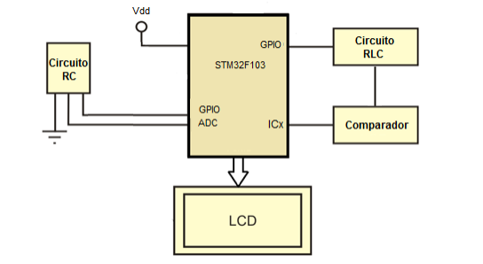

# Ejercicio de Entrega: Medidor de L y C

## Hardware

- STM32F103C6 Microcontroller
- LM393N
- LCD 2x16
- Resistencias, capacitores y bobinas.

  

## Parte I: Firmware, Simulacion y Depuracion

- Desarrollar el firmware del MCU para implementar la medicion de capacidad e inductancia como se muestra en la figura
- Los componentes a medir se encuentran en circuitos RC y RLC, con C y L como incognitas. Investigar un metodo de medida
  - En el circuito LC se debe determinar C
  - En el circuito RLC se debe medir L
- El sistema debera mostrar los valores de capacidad e inductancia en un display LCD cada 0.5 s

Simular con Proteus y realizar un informe con descripcion detallada del firmware, modularizacion y forma de adquirir, procesa y presenta los datos en pantalla junto con una validacion del sistema.

## Parte II: Diseno de Hardware: Circuito Impreso (PCB)

### 1. Diseno del Esquema Electrico

Disenar un esquema electrico completo con todos los componentes y sus conexiones. Tener en cuenta que la PCB tendra todos los conectores necesarios para conectar la placa BluePill completa, la cual proveera de alimentacion al resto de los circuitos y los conectores para colocar los elementos pasivos de L y C a medir.

En el informe, realizar un resumen de los procedimientos de diseno de la PCB y adjuntar imagenes de la capa superior (componentes), inferior (soldadura) y vistas 3D del circuito completo.

### 2. Requerimientos del diseno del PCB para fabricacion artesanal

- Simple faz de tamano maximo 10x10 cm
- Pads o vias: 1.8 mm de corona, 0.7 mm de agujeros.
- Ancho de pista y separacon: minimo 0.7 mm, recomendado 1.0 mm.
- Sin serigrafia de componentes
- Sin mascara antisoldante

## Blibliografia y Referencias

- "The STM32F103 Arm Microcontroller and Embedded Systems, Using Assembly and C, First Edition", Ali Mazidi M., Naimi S., Naimi S.
- "Differential Equations, with Boundary-Value Problems, Eight Edition", Zill D., Wright W.
- "Circuitos Electricos, Sexta Edicion" Dorf, Svoboda.
- "GLOSARIO: Conceptos Generales Sobre Circuitos Impresos" Brengi D., 2018.
- "La Suite Proteus: Primeros Pasos con la Pestana Diseno", Labcenter Electronics, 2019.
- "LMx93-N, LM2903-N, Low-Power, Low-Offset Voltage, Dual Comparators" Texas Instruments, 2018.
- "LM2903, LM393/LM393A, LM293A Dual Differential Comparator" Fairchild Semiconductor, 2012.
- "Mastering STM32, A step-y-step guide to the most complete ARM Cortex-M platform, using a free and powerfull development environment based on Eclipse and GCC" Noviello C., 2016.
