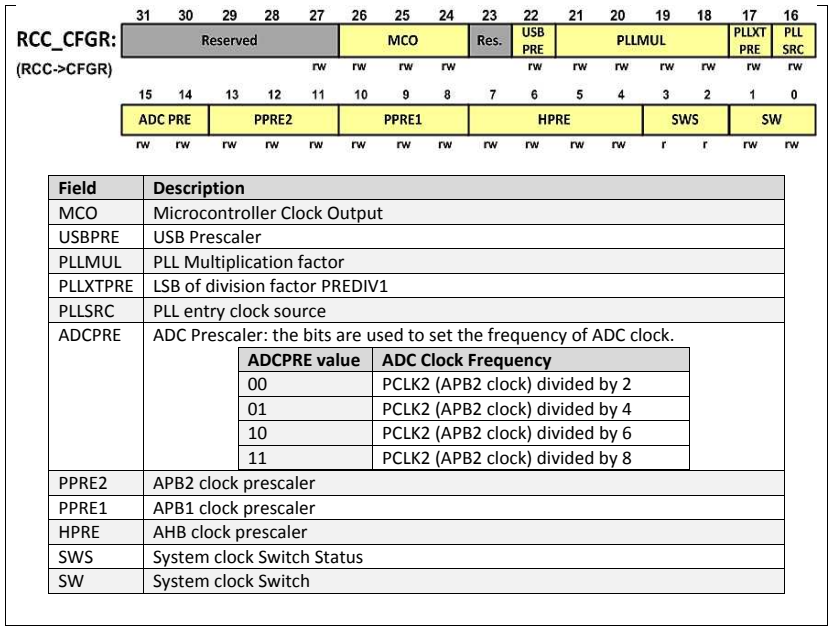

# ADC STM32F103

## 1. Enabling Clock to ADC

- The first thing we need to do is to enable de clock to the ADC module
- Bits 9, 15 and 15 of RCC_APB2ENR to enable ADC1, ADC, and ADC3.

  

## 2. Setup Frequency

The ADC clock can be 12MHz ant most. There is a divider btwn APB2 clock (PCLK2) and ADC which makes a lower CLK freq from APB2 clk. 
- The divider is configure by the ADCPRE bits of RCC_CFGR register
- ADC clk is 12 MHz when CPU freq is 72MHz

  

## 3. ADC Data Register

- The result of conversion is placed in ADCx_DR register.
- 16-bit register. Only 12 used.
- Align bit of ADCx_CR2 is used to right or left justified.

## 4. ADC Control Register

  

- ALIGN: 9 right, 1 left. El normal es alinear a la derecha (0000D11,D10,...,D0)
- DMA: direct memory access. 0 dis, 1 ena
- CAL: Calibration. Set to 1 to calibrate. Clears by hardware when finished. Calibrar al encender
- CONT: 0 single, 1 continuous. El continuo sigueh asta que CONT se limpie por software
- ADCON: OFF=0, ON=1: Para encender e iniciar las converrsiones
  - IMPORTANTE: Debe existir un DELAY de 1us entre el encendido y la primer conversion
  - 0 > 1: ADC turns on
  - 1 > 1: Conversion starts

## ADC Sequence Registers

In single mode, we store the imput channel in the SQ1 bits of ADCx_SQR3, and leave all the other bits of ADCx_AQR registers zeros.