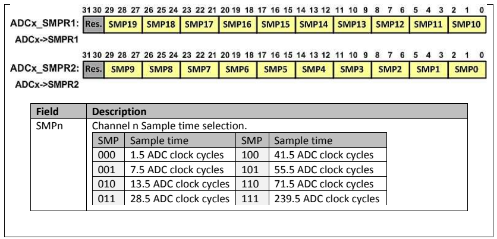

# ADC STM32F103

## 1. Enabling Clock to ADC

- The first thing we need to do is to enable de clock to the ADC module
- Bits 9, 15 and 15 of RCC_APB2ENR to enable ADC1, ADC, and ADC3.


## 2. Setup Frequency

The ADC clock can be 12MHz ant most. There is a divider btwn APB2 clock (PCLK2) and ADC which makes a lower CLK freq from APB2 clk.

- The divider is configure by the ADCPRE bits of RCC_CFGR register
- ADC clk is 12 MHz when CPU freq is 72MHz

  

## 3. ADC Data Register: ADCx_DR

- The result of conversion is placed in ADCx_DR register.
- 16-bit register. Only 12 used.
- Align bit of ADCx_CR2 is used to right or left justified.

## 4. ADC Control Register

  

- ALIGN: 9 right, 1 left. El normal es alinear a la derecha (0000D11,D10,...,D0)
- DMA: direct memory access. 0 dis, 1 ena
- CAL: Calibration. Set to 1 to calibrate. Clears by hardware when finished. Calibrar al encender
- CONT: 0 single, 1 continuous. El continuo sigueh asta que CONT se limpie por software
- __ADCON: OFF=0, ON=1: Para encender e iniciar las converrsiones__
  - IMPORTANTE: Debe existir un DELAY de 1us entre el encendido y la primer conversion
  - 0 > 1: ADC turns on
  - 1 > 1: Conversion starts

## ADC Sequence Registers

In single mode, we store the imput channel in the SQ1 bits of ADCx_SQR3, and leave all the other bits of ADCx_AQR registers zeros.

## ADC Sample Time Registers: ADCx_SMPR1:2

  

ADC Samples the input volgage in a capacitor. You can configure the sample time for each channel using SMPR1 and 2.

## ADC Status Register: ADCx_SR

### EOC

- EOC is set when the conversion is finished.
- EOC is cleared by software
- EOC is automatically cleared if we read ADCx_DR register

### Bits and Flags

- 4 __STRT: Regular channel START FLAG__
- 3 JSTRT: Injected channel start flag
- 2 JEOC: Injected channel EOC
- 1 __EOC: Regular Channel EOC (0: not complete, 1: complete)__
- 0 AWD: Analog WatchDog Flag
  
## Programming ADC using Polling

1. Enable the clock for the ADC and GPIO using APB2ENR Register
2. Make the pin for the selected ADC channel an analog input pin.
3. Turn on the ADC module since it is disabled upon power-on reset to save power.
4. Initialize the ADCx_SMPR registers to select a proposer sample time for the channels you use.
5. Wait  1 us to stabilize the ADC module
6. Start conversion writing a ONE to ADCON bit.
7. Wait for the conversion to be completed by polling the EOC bit in the ADCx_SR register.
8. when EOC is high, read ADCx_DR register
9. back to 6 to repeat.

## Programming ADC using Interrupts

- __EOCIE: EOC Interrupt Enable (Regular Channel End of Conversion)__
- AWDIE AWD Interrupt Enable (Analog WatchDog Flag)
- JEOCIE JEOC Interrupt Enable (Injected Channel End of Conversion)

  

if EOCIE=1 whern EOC is set to HIGH at completion of conversion, an interupt is generated. The CPU jumps to ADC Interrupt Handler.

## Techniques to Reduce the Impact of ADC and Vref variation

1. Connecting a capacitor between Vdda and GND. To get a better accuracy of ADC we must provide a stable voltage source to the Vdda pin.
2. Connecting a capacitor between Vref+ and Vref- to make the Vref voltage more stable and increase de precision of ADC

  

## Sensors

The common transducers produce an output in the form of voltage, current, charge, capacitance or resistance. In order to perform A2D conversion, they need to be converted to voltage, unless the transducer output is already voltage.

In addition to the conversion, the signal may aslo need gain and offset adjustment to achieve optimal dynamic range. A low-pass analog filter is often incorporated in the singal conditioneing circuit to eliminate the high frquency to avoid alising.

## Example

```c
/* configure PA1 (ADC_IN1) as ADC Input */
/* Sends result through USART1 */

#include <stm32f10x.h>
#include <stdio.h>

void usart1_init(void);
void usart1_sendByte(unsigned char c);
void usart1_sendStr(char *str);
void usart1_sendInt(unsigned int i);

void delay_ms(uint16_t t);
void delay_us(uint16_t t);

volatile uint16_t adcResult;

void ADC1_2_IRQHandler(void)
{
  adcResult = ADC->DR; /*read de result */
}

int main(void)
{
  RCC->APB2ENR |= 0xFC | (1<<9) | (1<<14); /* Enable clocks for GPIO, ADC1 clock, and USART1 */
  GPIOA->CRL = 0x44444404; /* PA1 (ADC_IN1) as analog input */
  ADC1->CR2 = 1; /* ADON = 1 (power-up) */
  ADC1->SMPR2 - 7<<3 /* SMP1 = 111 (239.5 ADC clock cycles) */

  delay_us(1); /* wait 1us to make sure the adc module is stable */

  usart1_init(); /* initialize the usart1 */

  ADC1->CR1 = (1<<5) = (1<<5); /* EOCIE = 1 */

  ADC->SQR3 = 1 /* choose channel 1 as the input */
  ADC1->CR2 |= 1<<1 /* CONT = 1 (Conver continously) */
  ADC1->CR2 |= 1<<0; /* ADCON = 1 (Start conversion) */

  NVIC_EnableIRQ(ADC1_2_IRQn); /* Enable ADC1_2 interrput */

  while(1)
  {
    usart1_sendInt(adcResult); /* send the adc result through serial */
    usaer1_sendStr("\n\r"); /* go to new line */

    delay_ms(10); /* wait 10 ms*/
  }
}

```
