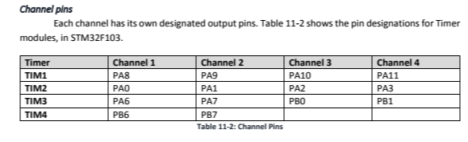

# SysTic timer

- Every ARM Cortex M.

## contador

- Down counter STCURRENT (Systick->VAL). cAN RECEIVE CLOCK from 2 diff sources.
- The clock ssc is chosen using CLK_SRC bit of STCTRL (SysTick->CTRL) register.

## Registros

### STCTRL (SysTick Control and Status)

- 0 ENABLE: 0 diasbled, 1 enabes systick
- 1 TICKINT: 0 int dis, 1 when systick counts to 0 int is generated.
- 2 CLKSOURCE: 0 AHB clock divideb by 8 - AHB clock
- 16 COUNTFLAG: 0 SysTick has not counted dt0 - 1: systick has counted to zero
- NOTE: COUNTLAG is clared by reading STRCTRL or writin STCURRENT.

### SysTick Reload value register (STRELOAD)

STREOAD is used to program de start value of ystick down counter. the stcurrent register, dth streload sohuld contain the value n0 1 for d=the count to fire envery n clock cycles 

# STM32F10x TIMERS

## Delay generation

### Types of Timers

- Basic
- General purpose (Timers 2, 3 and 4)
- Advanced control timers (Timer 1)


## Registers

### CNT (Counter)

- 16-bit up/down counter.
- TIMx_CNT to load value

### ARR Auto Reload Register

- 16 bit  
- Continously compared with the TIMx_CNT reg


### TIMx_CR1 (Control Registe)

- ways: up, down, and both like a yoyo


- 9-8 CKD: Clock division used by dead-time
- 7 ARPE: Auto reload preload enable 0 ARR not buff, 1 Buffered
- 6-5 Center-aligned mode selection 
    - 00 up or down
- 4 DIR: is CMS is 00, dir chooses te direction of counting. 0 ups, 1 down 
- 3 OPM: one pulse mode 0 continously, 1 counter stops at the next update event 
- 2 URS update request source 
- 1 UDIS update disable (mask)
- 0 CEN counter enable 0 DIS, 1 ENA

### TIMx_SR (Status Register)


- 0 UIF: Update Interrupt Flag. 
- When conuting up mode, when the value CNT reaches ARR, UIF flag is SET. The lag remains high until it is clered by software in the counting down mode. The flag is se twhn conuter sreaches 0 

### Counting Up

- When TIMx_CNT counter is counting up, it is compared with the ocuntents of TIMx_ARR register. 
- When CNT and ARR are equal UIF flag goes up indicating is a match and CNT rolls over to zero.

### Enabling Clock

For each timer we have a separate clock enable bit in RCC_APB1ENR and RCC_APB2ENr registers.

## Making Delays using TIM timer in up counting mode 

1. Enable the clock to TIMx module
2. load TIMx_ARR register with proper value
3. Clear UIF flag.
4. Set mode as up couter timer and enable timer 
5. Wait for UIF flag to go HIGH
6. Stop the timer 


## Prescaler 


- Contains a 16 bit up counter and a comparator
- up-counter counts from - t value of TIMx_PSC reg.
  

```c
/*
- ARR = 71 -> 72 states (clk goes from 0 to 71) 
- default timer clk *72MHz -> each clock lasts 1/72MHz
- so delay = 71 * 1/72Mhz = 1us
*/
void delay()
{
    RCC->APB1ENR |= (1<<0); /* enable TIM2 clk */
    TIM2->ARR = 71;
    TIM2->SR  = 0; /* clear UIF flag */
    TIM2->CR1 = 1; /* up counting */
    while((TIM2->SR & 1) == 0); /* wait until UIF flag is set */
    TIM2->CR1 = 0; /* stop counting */
}

void delayConPrescaler()
{
    RCC->APB1ENR |= (1<<0);
    TIM2->PSC = 7200-1;   /* psc = 7199 */
    TIM2->ARR = 500-1;

    TIM2->SR = 0;  /* clear UIF */
    TIM2->CR1 = 1; /* up counting */
    while((TIM2->SR & 1) == 0); 
    TIM2->CR1 = 0; /* stop counting */
}


void delayOnePulseMode() //timer stops automatically
{
    RCC->APB1ENR |= (1<<0); /* enable TIM2 clk */
    TIM2->PSC = 7200-1;
    TIM2->ARR = 500 - 1;
    TIM2->SR  = 0; /* clear UIF flag */
    TIM2->CR1 = 9; /* up counting & OnePulseMode*/
    while((TIM2->SR & 1) == 0); /* wait until UIF flag is set */
}
```

## Programming Output Compare 

- In some apps we need control digital output transition with PRECISION TIMING.
- In STM32 each TIMx has 4 channels 
- Each ch has an input circuit for input capturing and output circuit for output compare.


### Cap/Comp Reg (TIMx_CCRn)

- CCR1 to 4.
- Readable and writable
- TIMx_CCRn is compared with TIMx_CNT after each clock cycle.
- When CNT and CCRn match, CCnOF flag is set HIGH
- There is a WAVE GENERATOR in each chanel, making pin go low to high (toggling ping).

### Cap/Comp Mode Reg (TIMx_CCMR1 TIM_CCMR2)

- D0-7, D8-15, D16-31, ... for ch1, ch2, ch3, and ch4
- Each ch has CCnS (Comp/Capt Selection)
- CCnS bits are used to enable the input or output circuit of the ch 
- CCnS = 00, output circuit is enable and channel is in Compare mode.
- OCnM select the behavior of the wave generator con copare match (TIMx_CNT = TIMx_CCRn). -> the wave generator might SET the pin, make low or toggle it. Example: if OCnM = 011 the wave gen toggles the GPIO on compare match


### Cap/Comp Enable Register (TIMx_CCER)


- if CCnP=0 the output of the wave generator goes directly to the GPIO pin.
- if CCnP=1 the output signal becomes INVERTED and goes to the GPIO pin.
- We must set the CCnE bit to 1 to let the wave generator change the GPIO pin.

## Channels 



## Wave Generation Examples


### Example 1: Simple Wave 

- Timer counts and toggles CH3 when CNT=CCR3.
- CCR3 is set to 200, so CH3 toggles after 200 clocks
- The CH3 pin toggles agin on next CNT=CCR3 
```c
int main()
{
    RCC->APB2ENR |= 0xFC; /* enable gpio clocks */
    RCC->APB1ENR |= (1<<0); /* enable TIM2 clock */
    GPIO->CRL = 0x44444B44 /* PA2: Alternate func output */

    TIM2->CCR3 = 200;
    TIM2->CCER = 0x1 <<8; /* CC3P = 0, CC3E = 1 */
    TIM2->CCMR2= 0x0030 /*toggle channel 3 */
    TIM2->ARR = 10000-1;
    TIM2->CR1 = 1; /* start counting */

    while(1)
    {
    }
}
```

### Example 2

```c
int main()
{
    RCC->APB2ENR |= 0xFC;   /* enable GPIO clocks */
    RCC->APB1ENR |= (1<<0); /* enable TIM2 clock  */
    GPIO->CRL = 0x44444BB4; /* PA2 (ch3), PA1 (ch2): alternate func. output */

    TIM2->CCR2 = 1000;
    TIM2->CCR3 = 3000;
    TIM2->CCER = (0x1<<8) | (0x1<<4); /* CC3P=0 CC3E=1 CC2E=1 */
    TIM2->CCMR1 = 0x3000; /* toggle channel 2 */
    TIM2->CCMR2 = 0x0030; /* toggle channel 3 */
    TIM2->PSC = 7200-1;
    TIM2->ARR = 10000-1;
    TIM2->CR1 = 1;
}
```

### Timer Status Register (TIMx_SR)

- Status flags for all the channels to monitor the status of all channels with a single read of the register.

  

# Timer for input capturing

- the IO pin of the channel is used to capture the signal transition events.
- when event occurs, content of TIMx_CNT is captured and saved in the CCRn register of the channel
  
    

1. The singal is filtered by the Noise filter: NF makes sure the signal is stable for a given number of clocks and then informs
2. Edge detector detects the rising and falling edges of the signal.

- Using CCnP of CCER we choose to capture RISING or FALLING edge.
- Using CCnS we choose the channel to be INPUT or OUTPUT mode. Also to choose the input signal. Example CC1S=01 captures TIMx_CH1 pin.

3. The divider can be used to set the ratio if you like to capture after 4 edges you can set ICnPSC to 10.

  

4. CCnE (CC Enable) is used to enable capturing. To capture, CCnE must be 1.
5. CCnG (CC Generation) of TIMx_EGR can be used to make a capture. If we set the bit, one capture takes place and then CCnG bit is cleared by hardware.

- On each capture, CCnIF flag of TIMx_SR is also set to 1 and remains 1 until is cleared by software.
- If we read TIMx_CCRn, CCnIF is cleared automatically.
- The bits of CCMR differ in output compare and input capture modes.
  - both modes the same bits are used as CCnS bits
  - When we set ch to input capture mode, the rolls of the other bits of the channel changes as shown 

  

### Steps to Program Input Capture

1. ENABLE THE CLOCK to the input pin GPIO port and TIMx module.
2. SELECT THE CHANNEL PIN as INPUT in the CRL/CRH registers.
3. SET the timer PRESCALER value.
4. Select the INPUT SIGNAL using CCMR1 and CCMR2.
5. Select the RISING/FALLING edge and ENABLE THE CAPTURE using CCER.
6. set the value of TIMx_ARR register
7. ENABLE TIMER
8. wait until the CCNIF bit is set in TIMx_SR.
9. READ the current counter value captured
10. calculate the current counter value difference from the last value.
11. save the current value for next calculation
12. repeat from step 8

### Example: MEasure the Freq of the wave and reports through usart1 */

```c
#include <stm32f10x.h>
#include <stdio.h>

void usart1_init(void);
void usart1_sendByte(unsigned char c);
void usart1_sendInt(unsigned int i);
void usart1_sendStr(char *str);

int main()
{
    RCC->APB2ENR |= (0xFC | (1<<14)); /* enable GPIO clocks and USaRT1 clock */
    RCC->APB1ENR |= (1<<0); /* enable TIM2 clock */

    usart1_init();

    GPIOA->CRL = 0x44444844; /* PA2 (CH3): Input pull-up */
    GPIOA->ODR |= (1<<2);
    
    TIM2->CCMR2 = 0x001; /* pin TIM2_CH3 as input for Ch3 */
    TIM2->CCER = 0x1 << 8; /* CC3P=0 (rising), CC3E=1 (enable) */
    TIM2->PSC = 7200-1;
    TIM2->ARR = 50000-1;
    TIM2->CR1 = 1; /* start counting */

    uint16_t t = 0;
    uint16_t t0 = 0;

    while(1)
    {
        while((TIM2->SR & (1<<3))) == 0); /* wait until cc3if flag sets */
        t = TIM2->CCR3; /* read the captured value */

        usart1_sendInt(t - t-); /* send the difference */
        usart1_sendStr("\n\r"); /* go to new line */

        t0 = t;
    }
}

void usart1_init()
{
    GPIOA->ODR |= (1<<10); //pull-up PA10
    GPIOA->CRH |= 0x444448B4; //RX1=input with pull-up, TX1=alt. func output
    USART1->CR1 = 0x200C;
    USART1->BRR = 7500; // 72MHz/9600bps = 7500
}

void usart1_sendByte(unsigned char c)
{
    while((USART1->SR& (1<<6))==0); //wait until TC flag is set
    USART1->DR = c;
}

void usart1_sendStr(char *str)
{
    while(*str != 0)
    {
        usart1_sendByte(*str);
        str++;
    }
}

void usaer1_sendInt(unsigned int i)
{
    char str[10];
    sprintf(str, "%d", i);

    usart1_sendStr(str);
}

```